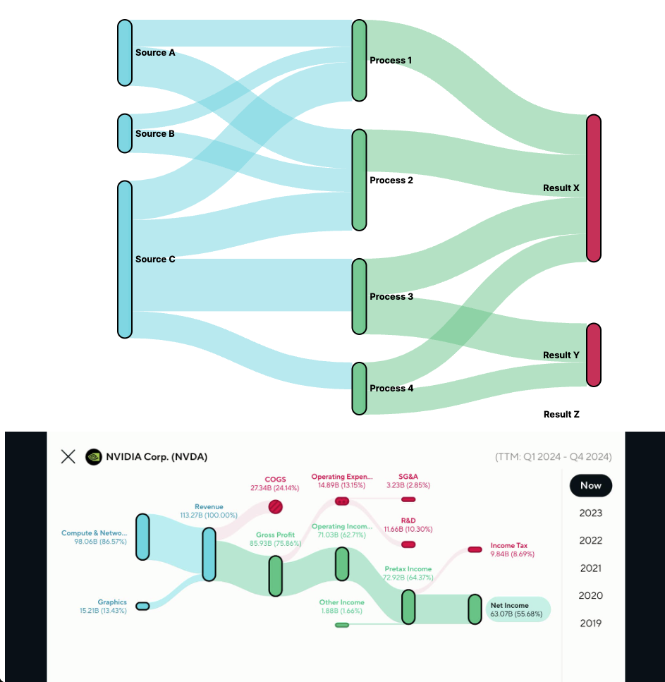

## d3-sankey-custom

- 90% of the code generated by claude.ai
- 10% of the modification is made on styling, sizing and css
- Inspired by [R-ket application](https://r-ket.app/) R-ket application's Sankey diagram on NVDIA Corp's income statement.
- Reference: https://www.facebook.com/natechawin.suthison/posts/pfbid02v4ods1vwXouD3EBZczH6gseHqdb6FWGmZorMn1AbvxBazUKfuEfrqBNoFNJXEys5l
